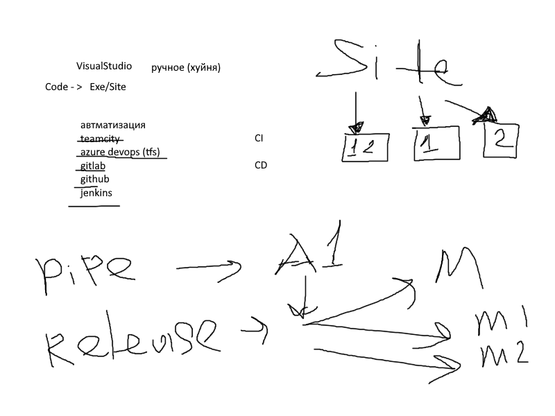

# 12. CI/CD

## Краткое описание

- Сказ о том как жи поменьше копировать файлики на боевой сервер руками.
- Небольшой обзор инструментов для автоматизации процессов.

## Видео

Таймкоды с описанием можно посмотреть [здесь](video.md)

В этом уроке ведущий Максим Грицина рассказывает о CI/CD и своём опыте автоматизации.
Будут рассмотрены практические примеры и советы по автоматизации дел.

Видео-урок по этой теме:

[.net помойка / JuniorFactory / 12. CI/CD](https://www.youtube.com/watch?v=wuQD1Jz80cY)
