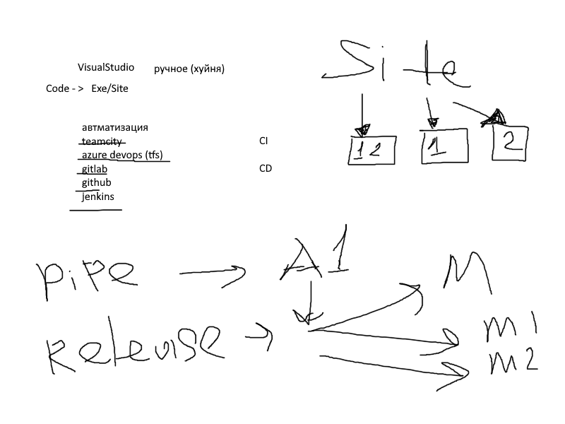

# 12. CI/CD

## Краткое описание

- Сказ о том как жи поменьше копировать файлики на боевой сервер руками.
- Небольшой обзор инструментов для автоматизации процессов.

## Видео

Таймкоды с описанием можно посмотреть [здесь](video.md) (авто-расшифровка, возможны неточности)

В этом уроке ведущий Максим Грицина рассказывает о CI/CD и своём опыте автоматизации.
Будут рассмотрены практические примеры и советы по автоматизации дел.

Видео-урок по этой теме:

[.net помойка / JuniorFactory / 12. CI/CD](https://www.youtube.com/watch?v=wuQD1Jz80cY)

Резервная копия (Rutube): [12. CI/CD](https://rutube.ru/video/73f0fa8fda206cdaa8ccc7c4ae5b0457/)

Резервная копия (VK Видео): [12. CI/CD](https://vkvideo.ru/video-227746634_456239045)

---

[← 11. Асинхронность и параллелизм](../JuniorFactory.Lesson11.Threads) · [Оглавление](../README.md) · [13. EF/ORM →](../JuniorFactory.Lesson13.LinqEf)
